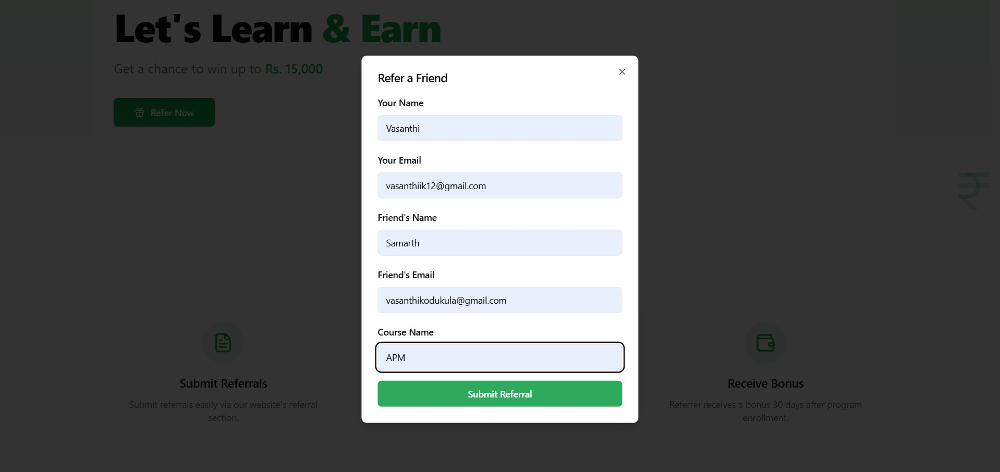
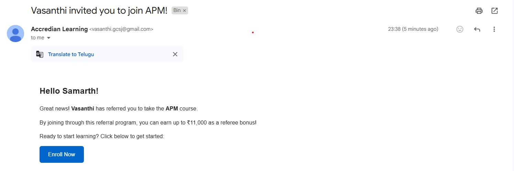

# Accredian Backend Task

Express.js backend for the referral marketing platform.



## Setup Instructions

1. Clone the repository
2. Install dependencies:
```bash
npm install
```
3. Create a `.env` file based on `.env.sample`
4. Run database migrations:
```bash
npm run db:push
```
5. Start the server:
```bash
npm run dev
```

## Features
- RESTful API endpoints
- PostgreSQL database integration
- Email notifications via Gmail
- Input validation

## Tech Stack
- Express.js
- TypeScript
- PostgreSQL
- Drizzle ORM
- Node.js
- Nodemailer
